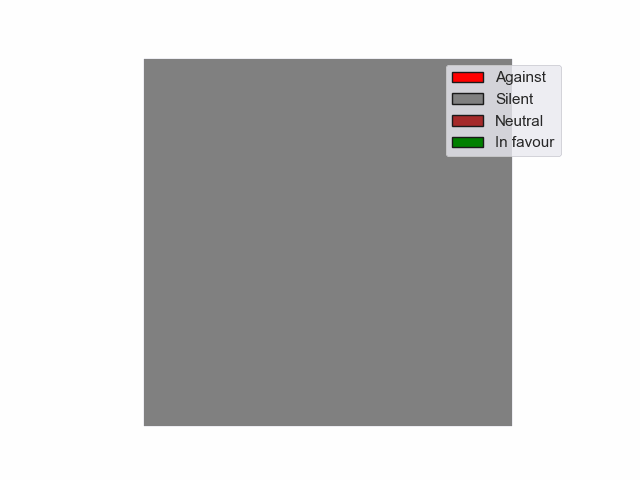

# Social Media Activity as Proxy for Opinion

Herein we study the problem of forecasting political outcomes based on politicians' social media activity analysis. We build up our data sets by scraping twitter posts of Brazilian congressmen in the period 2019-2021. We also explore some results obtained by the use of sentiment analysis over the same data.
We model the system using Markov Chains and explore its properties to obtain expectation values and probabilities.

This work is the result of a collaboration between Heitor Ponchio and João Medeiros, PhD

## Visualizations

### All Politicians (Sorted)

*Evolution of all politicians' opinions, sorted by position*

### Party-Specific Evolution

*Evolution of opinions within a specific party shown in a 5x5 grid*

### Color Legend
- 🔴 Red: Against (-1)
- ⚫ Gray: Silent/Neutral (0)
- 🟢 Green: In favor (1)

## Project Overview

In an increasingly connected world, social media has become an extension of traditional political discourse. What was once debated exclusively in chambers and offices now also happens in tweets and posts. This raises an intriguing question: can we predict the outcome of a congressional vote just by analyzing what politicians say on Twitter?

Our study explores this very idea. We analyzed the Twitter posts of Brazilian congressmen during the period from 2019 to 2021, focusing on social security reforms proposed by the right wing president Jair Bolsonaro. The tweets were obtained using Twint, a Twitter scraping tool which was functional back then. Using a probabilistic model, which will be detailed in following posts, we classified politicians as either in favor, neutral, or against the bill and attempted to predict the final voting outcome.

### The Power of Social Media in Politics
As we move further into the 21st century, social media platforms have become increasingly influential in political processes. In recent elections worldwide, platforms like Twitter and Facebook have played crucial roles in shaping public opinion and even influencing the results at the polls.

Applications of sentiment analysis on Twitter data have shown promising results, not only in modeling the political landscape but also in predicting election outcomes. However, while most studies focus on large volumes of data and statistics, our work proposes a more targeted approach: specifically studying the tweets of politicians to understand how they can predict important voting outcomes.

### The Challenge of Predicting Votes

Our challenge is knowing in advance whether a bill will be approved. In order to do this, we used a model that considers the opinions expressed by politicians on Twitter. Each politician can express support, opposition, or indecision regarding the bill. From these statements, we generate a score that reflects each politician's tendency at a given time. This score is given by a function of the sentiment present in the historical set of tweets which pertain to the discussion around the bill.

The mathematical probability scoring model is characterized by following parameters:

•⁠ ⁠λ : the weight of sentiment in old tweets, in regards to the new ones, takes values between 0 and 1. Note that λ = 1 is a special case called last declaration score, where only the most recent tweet defines the politicians position on the studied matter. This parameter serves the purpose of adjusting the model appreciation of a politician's stance according to the target political climate's volatility.

•⁠ ⁠δ : the threshold for the sentiment score, takes values between -1 and 1, corresponding to rejection and approval of current discussed issues. if the module of the score is under δ, the politician's position on the matter is considered undefined. As the voting day approaches, politicians face increasing pressure to take a clear stance. Our model adjusts this pressure via a dependency of parameter δ on time, making it harder for politicians to remain neutral as time goes by.
