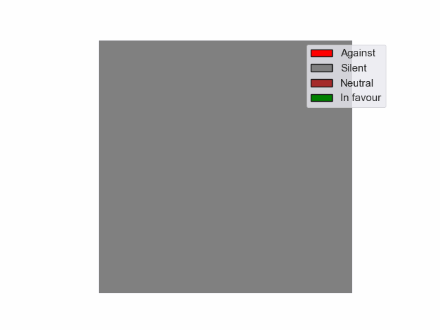

# Political Opinion Evolution Visualization

This project analyzes and visualizes the evolution of politicians' opinions over time regarding matters to be voted in congress.

## Visualizations

### All Politicians (Unordered)

*Evolution of all politicians' opinions shown in an 18x18 grid*

### All Politicians (Sorted)

*Evolution of all politicians' opinions, sorted by position*

### Party-Specific Evolution

*Evolution of opinions within a specific party shown in a 5x5 grid*

### Color Legend
- 🔴 Red: Against (-1)
- ⚫ Gray: Silent/Neutral (0)
- 🟢 Green: In favor (1)

## Usage

To generate these visualizations, use the following functions:
- `animate_unordered()`: Creates unordered visualization of all politicians
- `animate_ordered()`: Creates sorted visualization of all politicians
- `animate_party()`: Creates party-specific visualization
